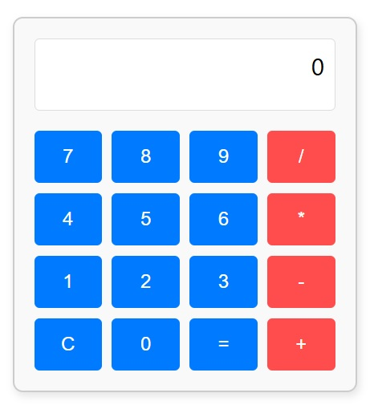

![Alt# 🧮 Simple Calculator



This is a basic calculator built with **HTML**, **CSS**, and **JavaScript**. It performs simple arithmetic operations like addition, subtraction, multiplication, and division. This project was created as a beginner exercise to practice working with JavaScript and DOM manipulation.

---

## ✨ Features

- Perform basic calculations: `+`, `−`, `×`, `÷`
- Simple and clean layout
- Click-based input using on-screen buttons
- Clear and reset functions

---

## 🛠 Technologies Used

- **HTML** – Structure of the calculator
- **CSS** – Basic styling
- **JavaScript** – Logic for handling operations and user input

---

## 📦 How to Run

To run this project locally:

1. Clone the repository:
   ```bash
   git clone https://github.com/your-username/calculator-app.git

